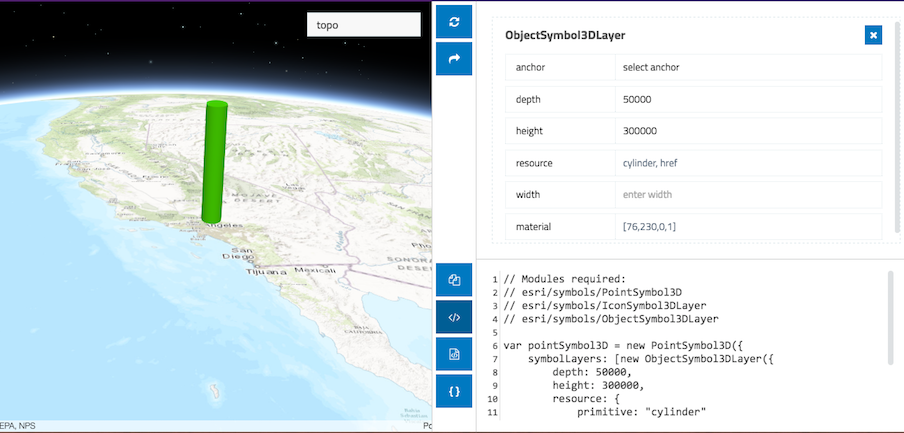

# ArcGIS API for JavaScript symbol playground

This app allows you to experiment with creating and modifying various symbols that may be used to represent data in the ArcGIS API for JavaScript. Select a symbol type and change its properties using the UI elements of the app. After designing a symbol, you can copy the code used to create it to the clipboard and paste it into your app. Remember to import the modules required for creating the symbol prior to referencing it in your app.

